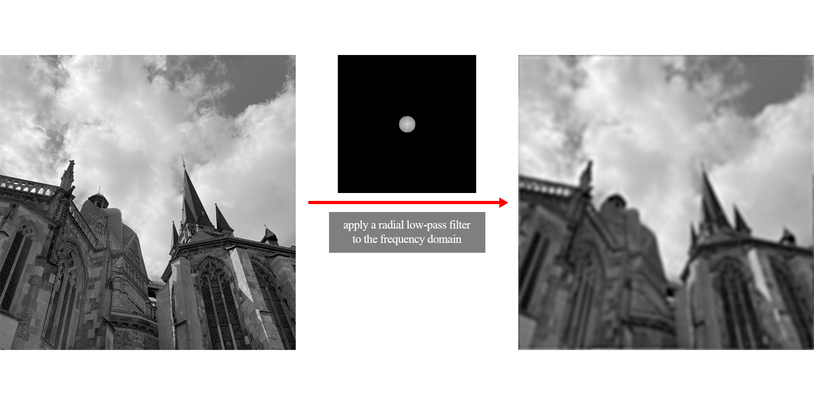
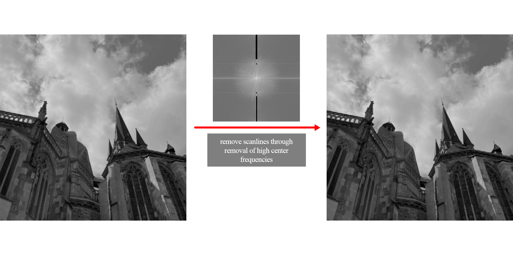

# 🌊 Fourier Transform

A small Kotlin project for computing and visualizing discrete Fourier transforms (DFT) and fast Fourier transforms (FFT)
on images.
It supports performing both forward and inverse Fourier transforms on 2-dimensional data (images).

This project isn't intended for production use. Its implementations are straightforward, easy to follow, and not
optimized for performance.

## ⭐ Features
- Implementation of 2D Discrete Fourier Transform (DFT) and Inverse DFT
- Implementation of 2D Fast Fourier Transform (FFT) using the Cooley–Tukey algorithm and its inverse

## 💡 Examples

These two examples show frequency-domain filtering in action. Understanding the theory is important for selectively achieving the results you want.

### Radial Lowpass filter

This example shows how applying a radial low-pass filter in the frequency domain produces a blurred image.

### Remove scanlines

By removing the strong central frequency components corresponding to scanlines, we can effectively eliminate them from the image while retaining most of the detail.

## ⚡ Use it

See the main function for an example of applying a mask in the frequency domain and then converting the result back to the spatial domain.
